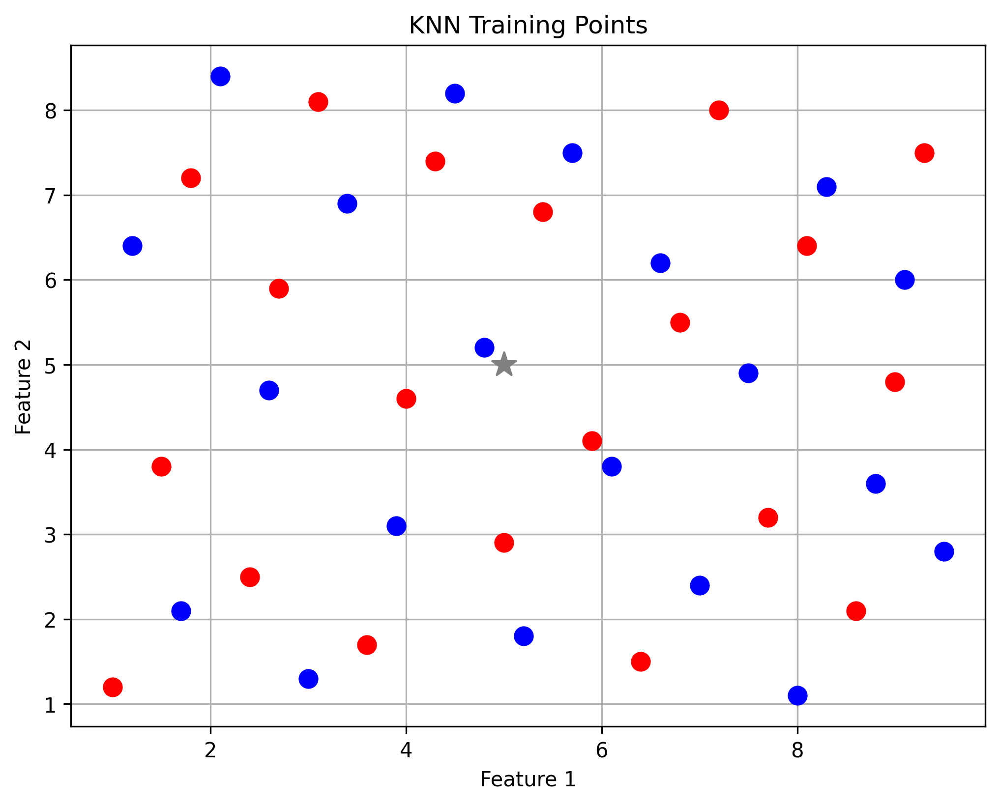
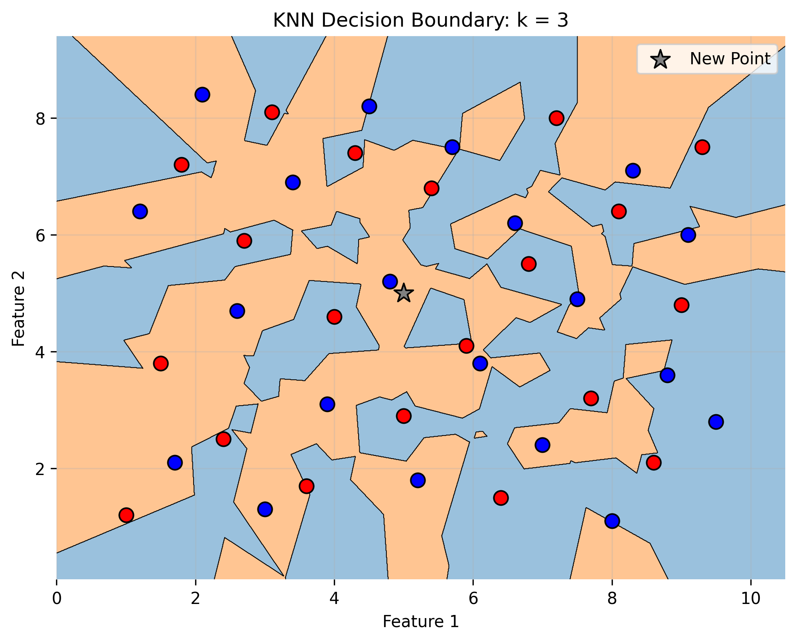
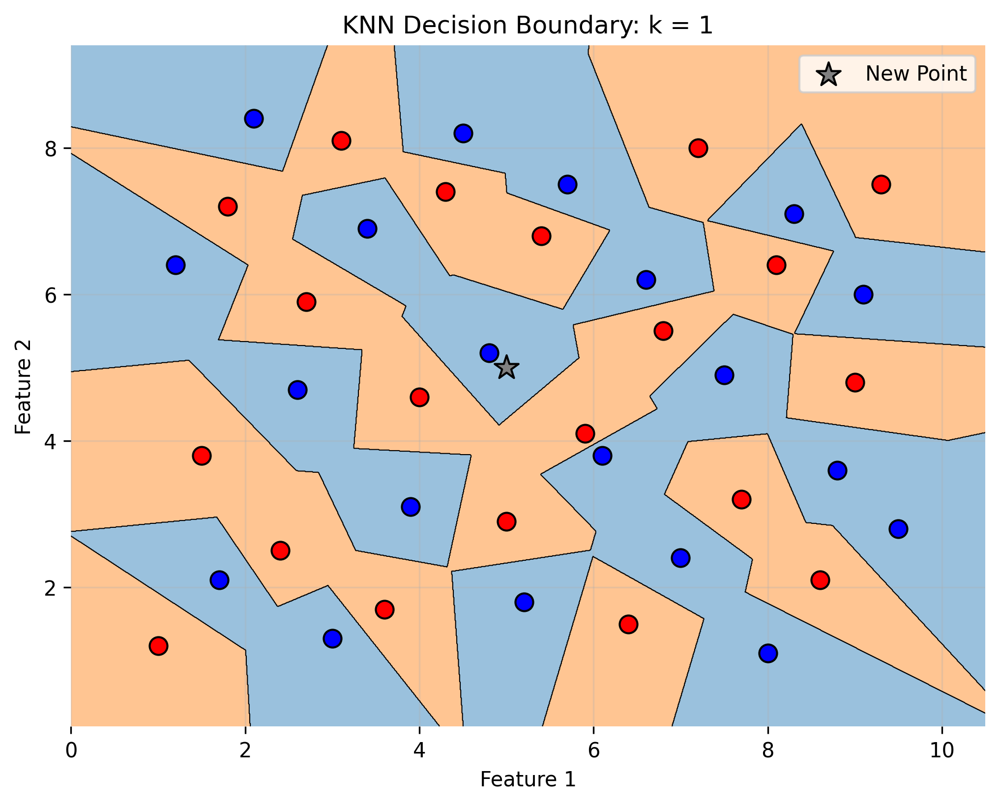
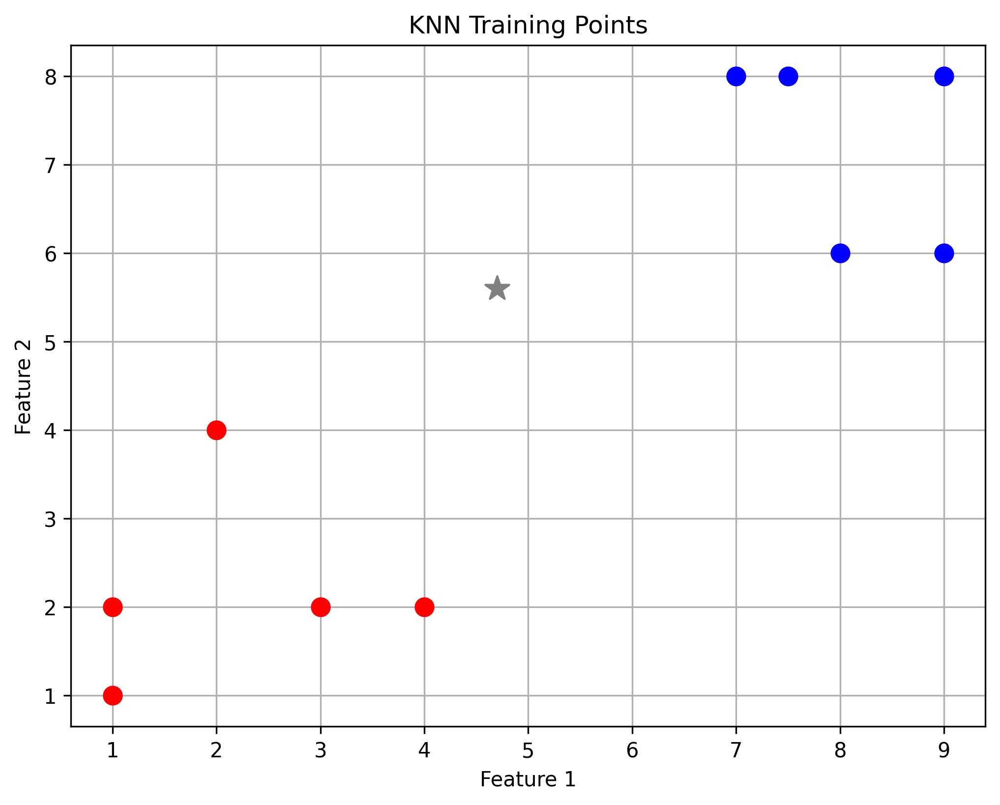
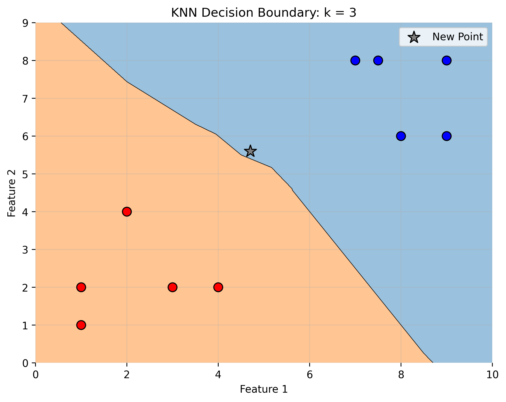
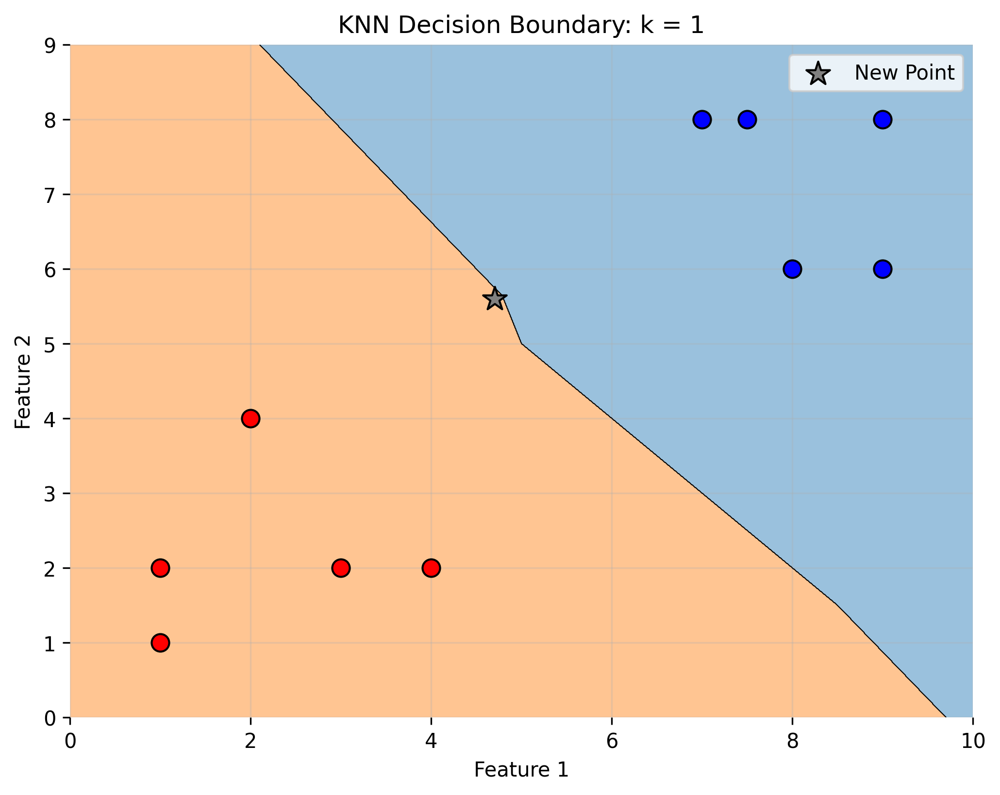

# K-Nearest Neighbours From Scratch

A from-scratch implementation of the **K-Nearest Neighbours (KNN)** classification algorithm in Python using NumPy.

This project demonstrates how KNN works internally by manually calculating Euclidean distance, finding the nearest neighbours, and using majority voting to classify new data points.

The project also includes visualisations showing how different values of `k` affect the decision boundary and can change how new points are classified.

I created a short guide explaining the mathematical theory behind KNN and how I implemented the algorithm from scratch in Python.
[Read more about the theory and implementation guide](#theory-and-implementation-guide)

## How It Works

For a new data point, the model:

1. Calculates the Euclidean distance to every training point
2. Sorts the points by distance
3. Selects the `k` nearest neighbours
4. Uses majority voting to predict the class

## Visual Preview

### Training Points



This graph shows the red and blue training points used by the model, along with the new point being classified.

### Decision Boundary, k = 3



This graph shows the decision boundary when `k = 3`. The model looks at the 3 nearest neighbours and classifies the new point based on the majority vote.

### Decision Boundary, k = 1



This graph shows the decision boundary when `k = 1`. The model only considers the single closest point, which creates a more sensitive and irregular boundary.

### Simple Training Points



This simpler dataset shows the basic idea of KNN with two clearly separated classes.

### Simple Decision Boundary, k = 3



With `k = 3`, the boundary is smoother because the prediction depends on multiple nearby points instead of just one.

### Simple Decision Boundary, k = 1



With `k = 1`, the boundary changes more sharply because each region is controlled by the nearest individual point.

## Why the Value of k Matters

The value of `k` directly affects how the model classifies new points.

A smaller `k`, such as `k = 1`, makes the model more sensitive to individual points. This can create more complex decision boundaries, but it may also make the model more affected by noise.

A larger `k`, such as `k = 3`, considers more neighbours before making a prediction. This usually creates a smoother decision boundary and can make the classification more stable.

This project visualises how changing `k` can change the shape of the decision boundary and potentially change the final classification.

## Theory and Implementation Guide

I created a short guide explaining the mathematical theory behind KNN and how the model was implemented from scratch in Python.

The guide covers:

* the intuition behind K-Nearest Neighbours
* how KNN classifies a new data point
* Euclidean distance
* selecting the nearest `k` neighbours
* majority voting
* why the value of `k` matters
* how the Python implementation connects to the theory

[Open the full guide](assets/K-Nearest-Neighbour.pdf)


## Technologies Used

* Python
* NumPy
* Matplotlib
* mlxtend

## Project Structure

```text
K-Nearest-Neighbour-From-Scratch/
│
├── assets/
│   ├── knn-training-points.png
│   ├── knn-decision-boundary-k3.png
│   ├── knn-decision-boundary-k1.png
│   ├── knn-training-points-simple.png
│   ├── knn-decision-boundary-k3-simple.png
│   └── knn-decision-boundary-k1-simple.png
    └── K-Nearest_Neighbour.pdf
│
├── src/
│   ├── __init__.py
│   ├── k_nearest_neighbour.py
│   └── plot.py
│
├── .gitignore
├── main.py
├── README.md
└── requirements.txt
```

## Running the Project

Clone the repository:

```bash
git clone https://github.com/jacksonjgee/K-Nearest-Neighbour-From-Scratch.git
```

Move into the project folder:

```bash
cd K-Nearest-Neighbour-From-Scratch
```

Create and activate a virtual environment:

```bash
python3 -m venv .venv
source .venv/bin/activate
```

Install the required Python packages:

```bash
pip install -r requirements.txt
```

Run the project:

```bash
python3 main.py
```

The project will plot the training points, generate the decision boundary visualisations, and save the graphs in the `assets/` folder.

## What I Learned

This project helped me understand:

* how KNN uses distance to compare data points
* how Euclidean distance is calculated
* how majority voting works
* how the value of `k` affects classification
* how decision boundaries can be visualised in 2D
